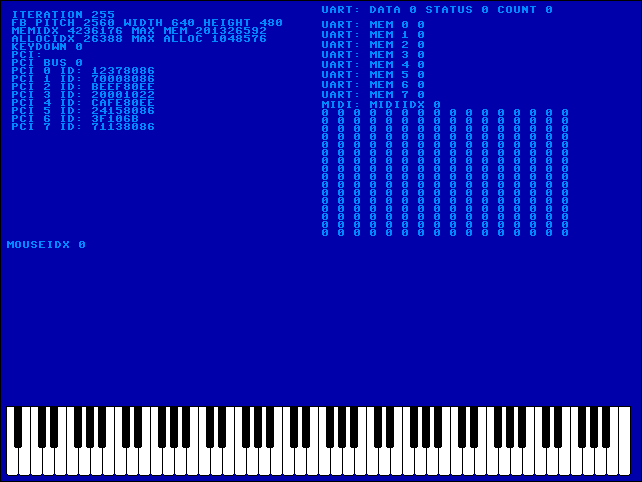

# MEDMOS

MIDI Emphasized Deterministic Monotasking Operating System

## Download ISO

http://arthurchoung.com/download/

## Overview

The goal of this project is to recreate the MIDI features of the Atari ST, on x86 hardware.

For some reason, I am fascinated by the Atari ST and how it is capable of solid, tight MIDI timing.
Some consider it to be the "gold standard" for MIDI timing.

I have always been frustrated by modern computers with USB becoming the dominant interface for music.

Adding to that frustration are modern operating systems that become slower and slower over time with
higher and higher latency.

So this project is intended to be a single tasking operating system along the lines of an Atari ST
or a Commodore 64, with a focus on MIDI and audio in general, where the audio hardware is accessed
directly, with nothing getting in the way.

I have never actually used an Atari ST before. I don't even think I have ever seen one in person.
During that era, I had a Commodore Amiga, and before that, a Commodore 64. I did not realize at the
time that the Atari ST is more of a successor to the Commodore 64, and the Commodore Amiga is more
of a successor to the Atari 800. The Atari ST has MIDI, while the Commodore 64 has the SID chip.

## Hardware Requirements

One of the following:

* Ensoniq AudioPCI 1370 (ES1370) (PCI ID: 0x50001274)
* Ensoniq AudioPCI 1371 (ES1371) (PCI ID: 0x13711274)
* Soundblaster Live (PCI ID: 0x00021102)

## Software Requirements

* grub2
* xorriso

## Notes

The Bare Bones tutorial at OSDev.org has provided the starting point for this project.

The Objective C runtime being used is the GCC runtime.

## How To Build

First, build the toolchain. You can edit the scripts to parallelize the builds (i.e. make -j4).

$ cd Toolchain

$ sh build_binutils.sh

$ sh build_gcc.sh

$ cd ..

Next, build the Objective C runtime.

$ cd ObjectiveC

$ sh build.sh

$ cd ..

Next, build the kernel.

$ cd Kernel

$ sh build.sh

$ cd ..

It should display "Done" if it is successful. Otherwise there is a compile error.

Next, build the supporting code.

$ git clone https://github.com/arthurchoung/HOTDOG

$ perl build.pl

Note that you are running the build.pl script in the MEDMOS directory, not the HOTDOG directory.

This should create a binary file 'ISO/medmos'.

Next, make the iso.

$ sh make_iso.sh

This should create an .iso file.

Finally, you can use 'dd' to copy the .iso file to a USB stick, and boot from it.

# 2022-06-16

I followed the Bare Bones tutorial at OSDev.org, and was able to get a basic system up and running.

It uses GRUB to boot a multiboot kernel into 640x480x32. GRUB and the way it selects a graphics mode
does not work consistently on my hardware, I've had the most luck with Nvidia. Long term, I am leaning
towards not using GRUB and simply using VGA mode 12h (640x480x4), since that should be good enough and
more compatible across my hardware.

I was able to get the Objective-C runtime up and running, as well as most of the code from HOTDOG.
This makes it easy to draw text using different fonts and so on. At the moment I am using the
Commodore 64 font and colors.

I am able to read input from the keyboard and mouse.

I am able to detect the ES1371, enable the UART, send MIDI data, as well as receive MIDI data and
indicate which notes are being played on the piano. I am currently polling, so the receive code is
hacky and very ugly. I really need to implement interrupts.

# 2022-06-18

I was able to get the ES1370 and Soundblaster Live working as well.

